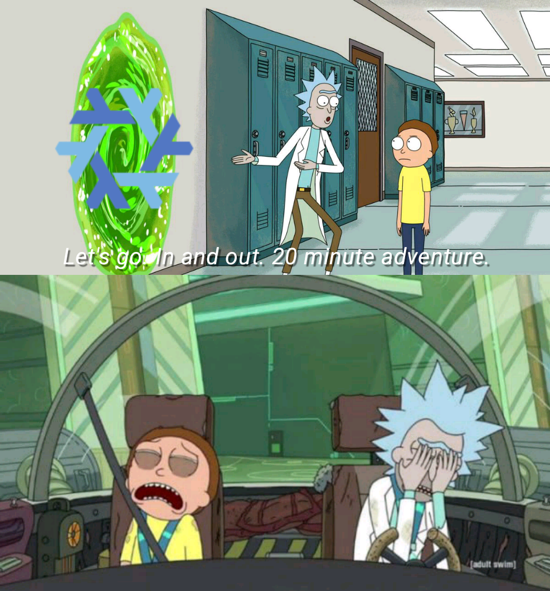

+++
date = '2026-02-22T06:44:46-06:00'
draft = false
title = 'Linux all the way down🐢'
summary = 'How learning ❄️Nix *Supercharged* my Linux skills🐧'
+++

# Infinite Regress♾️🌏🐢🐢🐢

The world is said to rest on the back of a giant turtle, which in turn stands upon the shell of another, larger turtle. That turtle is atop the shell of yet another larger turtle, and so on.

The allegory `Turtles all the way down` illustrates ***infinite regress***, a logical paradox where an explanation relies on the same explanation repeatedly, never reaching a final foundational truth.

For software the final foundational truth is **Bytes on Disk**. Yes I know that there is deeper nest, ones and zeros, or even electron present or not . . . but that is not the point.

For software developers, the point is to learn how to put **Bytes on Disk**.

# What if you compiled EVERYTHING from source code? 🧑‍💻

Everyone knows that installing from source code is technically the best way to install a program. But what maniac 🤪 would do that for every piece of software they use? Firefox, VSCode, the Desktop Environment, Glibc, GCC, Coreutils, Systemd, GPU Drivers, and the Linux Kernel . . .

What if instead of installing a iso file, you went to every piece of software's public git repo and compiled EVERYTHING from source code and put all the right files in the correct file structure to make a bootable Linux machine? **`Linux From Scratch`**. You'd be nuts🥜, right?

#### The benefits of this approach are many. You would have:
- `Absolute Educational Value`: Single best way to understand how an operating system ***really*** works.
- `Free and Open Source`: Only public licensed software is used. No proprietary software.
- `Bleeding Edge Access`: Pulling from the *main* or *unstable* branches gives access to features and bug fixes before anyone else.
- `Ultimate Customization`: Change build flags and get hardware optimization for your specific hardware.
- `Supply Chain Visibility`: Knoweldge of where everything came from and what git commit hash it was built from.
- `Dependency Graph`: See the entire dependency graph of the entire system.
- `Zero Bloat`: Your system will have zero *mystery* processes. If a service is running, it is because you explicitly wanted it to be running.

#### The downsides are many. You would have:
- `Exorbitant Time Costs`: Compiling a kernel takes a long time.
- `Nightmare Maintenance`: You have no package manager (apt, yum, pacman). To update a piece of software, you must manually git pull, reconfigure, recompile, and reinstall it.
- `Dependency Hell`: Software A might require version 1.2 of Library B, but Software C requires version 1.4 of Library B.
- `System Instability`: Will take many tries to get usable computer.
- `Security Risks`: While you theoretically have a smaller attack surface, you are also responsible for updating to the security patches.

#### Summary:
✅ **Do it if**: You want to become a Linux expert and understand the deep internals of the OS.

❌ **Don't do it if**: You want a usable computer to get work done today.

## ❄️**NixOS** *is* **Linux From Scratch**

If `Linux From Scratch` is building a car by manually welding every piece of metal yourself, **NixOS** is writing a blueprint for a car and having a robot factory build it for you instantly every time you turn the key.

Essentially, **NixOS** is Linux built from source by a bunch of bash scripts. There is ***a lot***, ***a lot*** more to it but **NixOS** is a Linux distribution. A very different linux distribution than most.

## Why I started using ❄️**Nix**

The end of life for Windows 10 came and I decided to try to use Linux as my daily driver. I installed Ubuntu 25.04. Things just worked. I was able to install all my favorite apps and games. 

In the course of learning Linux, I did a lot of tinkering with my system. Changing many files in the `/etc/` directory. Copy and pasting commands from the internet not knowing what they did. 

Everytime I made a change I was very nervous. I didn't know what I was doing and if I broke something then I couldn't boot into my system and I only had one computer at the time! I would have to debug my bricked computer by googling on my phone. **Scary Stuff!**

Time came where my tinkering caught up with me. My system was unstable and when I tried fixing it, it became unbootable!

As I sat there staring at my monitor waiting for my computer to boot up for 30 minutes, I yearned for a better way.

I remembered a `Fireship` video about this thing called **Nix**. I had watched it and liked the concept but knew to use **Nix** I would have to learn a new language and invest a lot of time in learning. So I just filed the info away in my head and said "I'll try it one day."

But I hate not having a bootable system! I need to do work soon. So I have to give **NixOS** a try just enough to get a working system.

On one of my family member's windows computer, I flashed a USB with the **Nix** graphical installer iso and *LIVE BOOTED* it into my computer and formatted my disks!

And it worked! I was surprised that I knew zero about **Nix** but my machine was in fact **NixOS**!

I was able to install the apps I needed. But gaming was a problem. Some issue with the proprietary nvidia gpu drivers. But Firefox and VSCode worked so I was fine.

For a long time I used the standard **NixOS** install. No version controll, no **Nix Flakes**. I was happy with that.

But I knew that I was missing alot of benefits of **Nix** by not using **Nix Flakes** and version controll. My next step was to learn enough to make my system a **Nix Flake** and version control in a private repo. And I wanted to use this thing called `home-manager` to manage my user's home directory.

After a crammed journey of learning **Nix** the programming language via youtube videos, I had an OS that was:
- Declarative
- Reproducible
- Version Controlled
- Rollback-able
- Multi-user
- Managed by a `Flake`
- Hardware acceleration with nvidia gpu *(this was a source of pain)*

## The Last %10

For fun I watch youtube videos from conventions and confernces. One day I watched a talk about this project called `Clan`.

Clan is a peer-to-peer computer management framework that empowers you to selfhost in a reliable and scalable way.
Built on NixOS, Clan provides a declarative interface for managing machines with Resource management, Networking, and Backups.

It is very early stages for Clan but I was very interested in this project and wanted to try it out. But they way they do things is a bit different than what my current system is.
At first I used Clan to manage a remote machine in Hetzner cloud and boy did I like it. Clan made managing my remote machine so much easier.

For VPS's I was running Ubuntu and Docker, specially the Coolify base image from Hetzner. But a NixOS machine is way safer and more reliable.

It took me a long time to be brave enough to make my local machine a `Clan` machine but now I will never go back.

## Why do people hate ❄️**Nix**?

Everyone knows that ***reproducible builds*** and ***declarative system configurations*** have inherit value.

People hate **Nix** because it forces you to pay a *massive* upfront cost. ***Learning*** a new hard thing + a ***paradigm shift***.

#### Things I hear people say about ❄️**Nix**:

- "I don't want to learn a new language."
- "A programming language with only lambda functions and no types? I don't know how to use that."
- "Eww, I have to learn a domain specific language just to build my package? Doesn't *( insert package manager here, pip, npm, apt, yum, etc )* do that for me?"
- "Can't we just use Dockerfiles?"

## Learning New Things Grows The Brain🧠
Unfortunately, "I don't want want to learn something new" is a common response.

And ok that's fine. But benefits of learning something new are huge, and not always obvious. Learning new things grows the brain.

Learning is a life long pursuit. Unfortunately some people, usually those with old habits and job security, give up on learning new things.

I hope to never give up learning new things.

Did I need to learn Nix? No. I could have used any number of operating systems, and *most* of them are great. If you prefer something else, no hate, all love. But I am judging. 🧑‍⚖️

Fedora, Arch, and Windows users are very different and have very different needs. They are great technologies when applied to the right context.

I'm really happy I learned Nix. And I'm happy if you are.

## Learing Nix Supercharged my Linux skills🐧
The `"Turtles"` metaphor extends to NixOS because everything in NixOS is what is called a `derivation`.

A derivation is a instruction sheet that tells Nix exactly how to build a package. ie putting bytes on disk. A derivation is the bridge between the dynamic world of the Nix language and the static world of the filesystem. It is the result of evaluating Nix code. It solves "dependency hell" by explicitly listing every single file required for the build before the build even starts.

EVERYTHING in Nix is a derivation. It is derivations all the way down. ie Nix is a factory that builds derivations.

Your OS is a derivation, your kernel is a derivation, your desktop environment is a derivation, your applications are derivations and so on. Everything is a derivation.

Once I learned how to make a derivation I was freed from the typical constraints of putting bytes on disk. All I had to do was write a derivation and Nix would build it for me.

When managing a `Kubernetes` cluster on NixOS, all I had to do was make the right set of derivations, systemd units, etc files, packagesand so on and when the machine booted I would have a fully functional Kubernetes cluster.

Low and behold, derivation unlocked the power of my machines! Putting bytes on disk is the name of the game. And Nix is the tool I have chosen to make it happen.

Learn how to put bytes on disk *declaratively* and in a *reproducable* way and you will unlock the power of your machines.

### Want to learn about Nix in 212 seconds?🔥🚢


### NixCon2024 Clan: Fully automated distributed NixOS management


